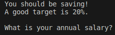

# Savings Goal 5.0 FINAL
## A fun little program that prompts you for a savings goals and answers questions based on your responses

### Requirements
1. Python 3.x
2. A IDE, Code Editor, or Terminal to run the file

### Usage
1. Ensure that the required packages are installed.
2. Run the program.
3. You will be greeted with the following script:

    
   
4. Type in your response and hit enter. Repeat and enjoy!
